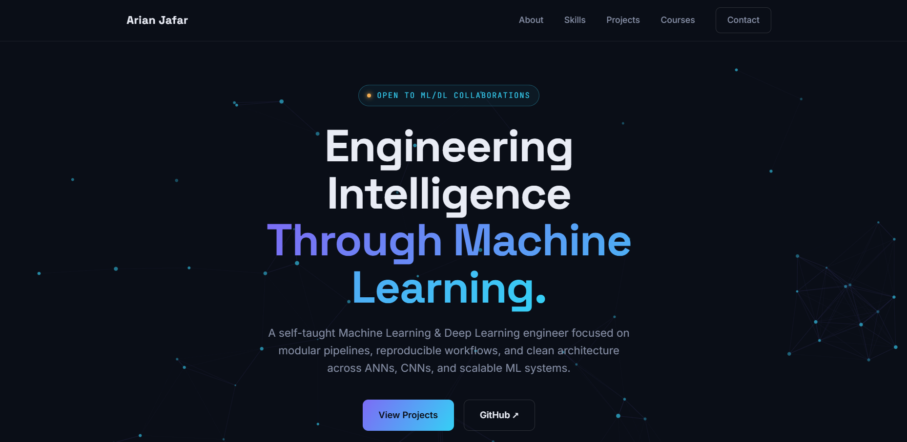

# 🌐 Arian Jafar — Personal Portfolio

A modern, responsive portfolio website showcasing my work in **Artificial Intelligence, Machine Learning, and Deep Learning**.

Designed with a clean, minimal aesthetic, the website highlights featured projects, technical skills, certifications, and professional experience while emphasizing reproducible machine learning workflows and software engineering best practices.

---

## 🔗 Live Website

**Portfolio**

> https://ArianJr.github.io

---

## 📸 Preview

<p align="center">
  
</p>

---

## ✨ Features

- Modern responsive interface
- Dark minimalist design
- Animated neural network hero background
- Smooth scrolling
- Scroll reveal animations
- Professional typography
- Featured Machine Learning projects
- Technical skills overview
- Certifications & courses
- GitHub integration
- Contact section
- Mobile-friendly layout

---

## 🧠 About

This portfolio represents my work as a **self-taught Machine Learning & Deep Learning engineer**.

The website focuses on:

- Artificial Intelligence
- Machine Learning
- Deep Learning
- Computer Vision
- Reproducible ML pipelines
- Clean software architecture
- Professional GitHub projects

---

## 🚀 Featured Projects

The portfolio showcases several complete AI and Machine Learning projects, including:

- Garbage Classification with Transfer Learning
- Credit Card Fraud Detection
- Chest X-ray COVID-19 Classification
- Google Stock Price Forecasting (LSTM)
- Student Performance Prediction
- Lung Cancer Prediction

Each project includes:

- Documentation
- Source code
- Model evaluation
- Visualizations
- Reproducible workflows

---

## 🛠 Tech Stack

### Frontend

- HTML5
- CSS3
- JavaScript (Vanilla)

### Design

- Responsive Layout
- CSS Grid
- Flexbox
- CSS Animations
- Glassmorphism
- Gradient UI
- Custom Color System

### Typography

- Space Grotesk
- Inter
- JetBrains Mono

### Development

- Git
- GitHub
- GitHub Pages
- VS Code

---

## 📂 Project Structure

```text
portfolio/
│
├── index.html
├── README.md
├── LICENSE
└── images/
    ├── profile.png/
    ├── favicon.png/
    └── preview.png/

```

---

## 🎯 Design Goals

The portfolio was designed with the following principles:

- Simplicity
- Performance
- Accessibility
- Responsive design
- Clean typography
- Consistent visual hierarchy
- Maintainable code
- Professional presentation

---

## 📱 Responsive

The website is fully responsive and optimized for:

- Desktop
- Laptop
- Tablet
- Mobile devices

---

## 📚 Courses & Certifications

Featured learning includes:

- Python for Data Science and Machine Learning Bootcamp
- Deep Learning A–Z
- Machine Learning Specialization (Andrew Ng)

---

## 📬 Contact

- **Email:** arianjafar59@gmail.com
- [GitHub](https://github.com/ArianJr)
- [LinkedIn](https://www.linkedin.com/in/arian-jafar/)

---

## ⭐ Repository

If you found this project interesting, consider giving it a star.

---

## 📄 License

This project is licensed under the MIT License.

Feel free to fork the repository and use it as inspiration for your own portfolio while providing appropriate attribution.
